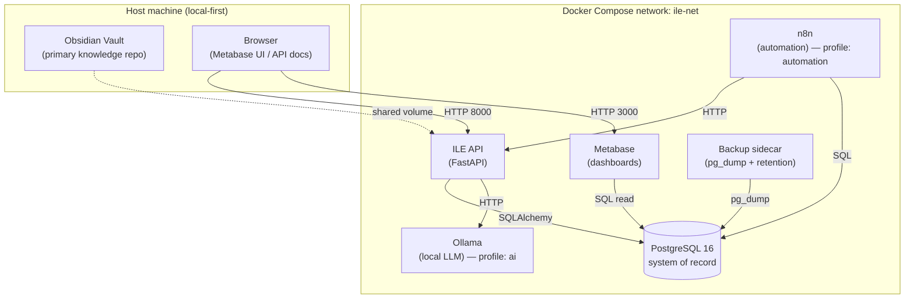

# 02 — System Architecture

**Product:** ILE — IKIGAI Learning Engine

---

## 1. Architectural Overview

ILE is a **local-first, service-oriented** system. Four core services run in
Docker Compose; two optional services (local LLM, automation) attach via
profiles. Obsidian runs on the host as the knowledge repository.



### Component responsibilities

| Component | Role | Tech |
|---|---|---|
| **PostgreSQL** | System of record: sessions, topics, goals, metrics, graph edges. | postgres:16 |
| **ILE API** | Domain logic, REST, orchestration, AI calls, retention math. | FastAPI + SQLAlchemy 2.0 |
| **Metabase** | Dashboards & graphs over Postgres views. | metabase/metabase |
| **Backup** | Daily `pg_dump`, gzip, 30-day retention. | postgres:16 + bash |
| **Obsidian** | Notes, study material, reflections, MOCs. | Host app + vault volume |
| **Ollama** *(opt)* | Local LLM for coach/quiz/summarize/interview. | ollama/ollama |
| **n8n** *(opt)* | Reminders, weekly summaries, review scheduling. | n8nio/n8n |

---

## 2. Layered View

```text
┌───────────────────────────────────────────────────────────┐
│ Presentation:  Obsidian · Metabase · API Docs · (future SPA)│
├───────────────────────────────────────────────────────────┤
│ Application:   FastAPI routers (topics, sessions, xp,       │
│                validations, interview, retention, ai,       │
│                analytics)                                   │
├───────────────────────────────────────────────────────────┤
│ Domain services: retention (SM-2), xp rules, llm client     │
├───────────────────────────────────────────────────────────┤
│ Data access:   SQLAlchemy models + SQL views                │
├───────────────────────────────────────────────────────────┤
│ Persistence:   PostgreSQL (tables, triggers, views)         │
└───────────────────────────────────────────────────────────┘
```

Design choices:
- **UUID primary keys** everywhere → SaaS/multi-tenant ready, safe to expose.
- **`user_id` on every owned row** → enables Row-Level Security later.
- **Views for analytics** → Metabase and API read the same definitions.
- **Triggers** keep derived values (topic XP totals, `updated_at`) consistent.

---

## 3. Repository / Folder Structure

```text
LLS/                                  # ILE monorepo
├── docker-compose.yml
├── .env.example                      # copy → .env (gitignored)
├── .gitignore
├── README.md
├── api/                              # FastAPI backend
│   ├── Dockerfile
│   ├── requirements.txt
│   └── app/
│       ├── main.py                   # app + router wiring
│       ├── config.py                 # env settings
│       ├── db.py                     # engine/session/Base
│       ├── deps.py                   # auth dependency (single-user/JWT)
│       ├── models.py                 # SQLAlchemy models
│       ├── schemas.py                # Pydantic DTOs
│       ├── services/                 # retention, llm
│       └── routers/                  # topics, sessions, xp, ...
├── database/
│   └── init/                         # runs on first Postgres boot
│       ├── 001_schema.sql
│       ├── 002_views.sql
│       └── 003_seed.sql
├── scripts/
│   ├── backup.sh
│   ├── restore.sh
│   └── cleanup-backups.sh
├── vault/                            # Obsidian vault (knowledge repo)
│   ├── 00-Dashboard/ 01-Learning/ 02-Business/ 03-Personal/
│   ├── 04-Templates/ 10-IKIGAI/ 99-Archive/
├── data/                             # runtime volumes (gitignored)
│   ├── postgres/ metabase/ backups/ ollama/ n8n/
└── docs/                             # this documentation set
```

---

## 4. Docker Architecture

- **Network:** single bridge `ile-net`; services reach each other by name.
- **Dependencies:** API, Metabase, and Backup wait for Postgres `healthy`.
- **Healthchecks:** `pg_isready` (Postgres), `/health` (API).
- **Volumes:** bind mounts under `./data` for durable state; `./vault` mounted
  into the API for note reconciliation.
- **Profiles:**
  - default → `postgres, api, metabase, backup`
  - `ai` → adds `ollama`
  - `automation` → adds `n8n`
- **Init order:** `database/init/*.sql` execute alphabetically on first boot
  (schema → views → seed).

Startup:
```bash
cp .env.example .env         # edit secrets
docker compose up -d                             # core
docker compose --profile ai up -d                # + local LLM
docker compose --profile ai --profile automation up -d
```

---

## 5. Security & Privacy

**Threat model priorities:** local device compromise, secret leakage, SQL
injection, and (future) multi-tenant data isolation.

Controls:
- **Local-first / no telemetry.** No outbound calls except opt-in Ollama (in-network).
- **Secrets** live only in `.env`; `.gitignore` blocks `.env`, `data/`, backups.
- **SQL injection:** all queries parameterized (SQLAlchemy / bound params).
- **AuthN/AuthZ:** single-user mode for local use; JWT bearer for multi-user;
  `role` column supports owner/member/coach/admin.
- **Least privilege:** backup uses `--no-owner --no-privileges`; future: dedicated read-only DB role for Metabase.
- **Row-Level Security (future):** every owned row has `user_id`; enable RLS policies for SaaS.
- **Transport:** put a TLS reverse proxy (Caddy/Traefik) in front for any non-localhost exposure.
- **Backups at rest:** copy `data/backups` to an **encrypted** external drive / private cloud.
- **Input validation:** Pydantic at the boundary; DB CHECK constraints as defense-in-depth.
- **Prompt-injection awareness:** AI outputs are informational; never execute LLM-produced SQL/commands.

Privacy posture: **you own the data, on your machine, by default.**

---

## 6. Backup & Recovery

- **Cadence:** every 24 h (`BACKUP_INTERVAL_SECONDS`).
- **Artifact:** `ile_YYYY-MM-DD_HH-MM-SS.sql.gz` in `data/backups`.
- **Retention:** 30 days (`BACKUP_RETENTION_DAYS`), auto-pruned.
- **RPO:** ≤ 24 h. **RTO:** minutes.
- **Restore:**
  ```bash
  docker exec -it ile-backup /scripts/restore.sh /backups/ile_YYYY-MM-DD_HH-MM-SS.sql.gz
  ```
- **3-2-1 guidance:** keep a second copy off-device (encrypted external + private cloud).
- **Verification:** periodically restore into a scratch database to prove backups are valid.

---

## 7. Monitoring & Observability

MVP (lightweight):
- **Liveness/readiness:** `/health`, `/ready` (DB check) on the API.
- **Container health:** Docker healthchecks + `docker compose ps`.
- **Logs:** structured stdout logs per container (`docker compose logs -f`).
- **AI metrics:** `ai_interactions` records model, latency, tokens.

Phase 2+ (optional):
- **Metrics:** add `prometheus-fastapi-instrumentator` → Prometheus → Grafana.
- **Uptime:** Uptime Kuma for service pings.
- **Alerts:** n8n workflow: notify if nightly backup file is missing.

---

## 8. Scalability Roadmap

| Stage | Users | Changes |
|---|---|---|
| **S0 — Personal** | 1 | Current stack; single-user mode; vertical scaling. |
| **S1 — Power users** | 1–5 | Turn on JWT auth; per-user data already isolated by `user_id`. |
| **S2 — Small team** | 5–50 | Enable Postgres **RLS**; move Metabase app DB to Postgres; reverse proxy + TLS. |
| **S3 — SaaS** | 50+ | Managed Postgres (read replicas), stateless API replicas behind a load balancer, object storage for artifacts, per-tenant Ollama or hosted model gateway, background workers (Celery/RQ) for AI + retention jobs. |
| **S4 — Scale-out** | 1000+ | Partition by tenant, connection pooling (PgBouncer), caching (Redis), event bus for analytics, horizontal autoscaling. |

The schema is intentionally SaaS-ready today (UUIDs + `user_id`), so scaling is
an infrastructure exercise, not a rewrite.
