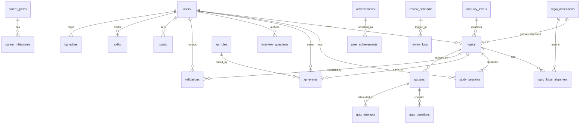

# 03 — Database Design

**Engine:** PostgreSQL 16
**DDL:** `database/init/001_schema.sql` (tables), `002_views.sql` (analytics),
`003_seed.sql` (reference + examples).

---

## 1. Design Principles

1. **UUID primary keys** (`gen_random_uuid()`) — externally safe, multi-tenant ready.
2. **`user_id` on every owned row** — future Row-Level Security with no migration.
3. **Enums as CHECK constraints** — portable and easy to evolve.
4. **`updated_at` via trigger** — single `set_updated_at()` function.
5. **Derived data via triggers** — e.g., `topics.xp_total` synced from the XP ledger.
6. **Generic knowledge graph** — one `kg_edges` table links any two entities.
7. **Views for analytics** — Metabase and API consume the same definitions.

Extensions: `pgcrypto` (UUIDs), `pg_trgm` (fuzzy title search).

---

## 2. Entity Groups

1. **Identity & reference:** `users`, `domains`, `ikigai_dimensions`, `maturity_levels`.
2. **Learning core:** `topics`, `topic_ikigai_alignment`, `skills`, `study_sessions`.
3. **Achievement:** `xp_rules`, `xp_events`, `achievements`, `user_achievements`.
4. **Validation:** `validations`, `quizzes`, `quiz_questions`, `quiz_attempts`.
5. **Interview:** `interview_questions`, `interview_simulations`, `interview_readiness`.
6. **Retention:** `review_schedule`, `review_logs`.
7. **Goals/career/business:** `goals`, `career_paths`, `career_milestones`, `certifications`, `projects`, `business_initiatives`.
8. **Execution & reflection:** `tasks`, `weekly_reviews`.
9. **Knowledge graph:** `kg_edges`.
10. **AI:** `ai_interactions`.

---

## 3. Entity–Relationship Diagram

> Note: `kg_edges` links entities generically (by `source_type/source_id` →
> `target_type/target_id`) rather than through hard FKs, so it is shown
> separately in the Knowledge Graph doc.

---

## 4. Key Tables (highlights)

### `topics` — the learning unit
Carries purpose (`why_it_matters`, `primary_ikigai`), progress
(`status`, `maturity_level`), gamification (`xp_total`), retention
(`retention_state`), and the Obsidian link (`vault_path`).

### `study_sessions` — raw analytics signal
Captures `duration_minutes`, `focus_score`, and **confidence before/after** —
the basis for "improvement over hours".

### `xp_events` — immutable ledger
Every point-earning action; an `AFTER INSERT` trigger (`apply_xp_to_topic`)
increments `topics.xp_total`. Point values live in `xp_rules`.

### `validations` — the completion gate
One row per validation attempt at **level 1–4**. Passing a level promotes the
topic's `maturity_level` (enforced in the API).

### `review_schedule` — retention engine
Per-entity SM-2 state (`interval_days`, `ease_factor`, `repetitions`,
`next_review`, `retention`). `review_logs` records each graded recall.

### `kg_edges` — knowledge graph
Typed relationships (`requires`, `advances`, `teaches`, `applies`,
`aligns_with`, `depends_on`, `relates_to`) between any entities.

### `interview_questions` — STAR-structured bank
Role/category, short + detailed answers, STAR fields, confidence, spaced review.

---

## 5. Reference / Seed Data

- **Domains:** Learning, Business, Personal.
- **IKIGAI dimensions:** Passion, Mission, Profession, Vocation (with colors).
- **Maturity levels:** 0 Discovered → 5 Expert.
- **XP rules:** Read 1, Notes 2, Lab 5, Quiz 5, Presentation 10, Teach 15, Project 20.
- **Achievements:** first_steps, week_streak, teacher, interview_ready, centurion, ikigai_balance.
- **Owner user:** fixed UUID `…0001` for single-user mode.
- **Example topics:** Agentic AI, Azure Architecture, AI Consulting, AI Education,
  Post Quantum Cryptography, Interview Preparation — each mapped to an IKIGAI dimension.

---

## 6. Analytics Views (for Metabase & API)

| View | Purpose |
|---|---|
| `v_daily_study_time` | Minutes + session count per day. |
| `v_weekly_study_time` | Minutes + active days per week. |
| `v_confidence_improvement` | Avg `after − before` per day. |
| `v_study_by_type` | Minutes by activity type. |
| `v_interview_readiness` | Avg confidence + counts per category. |
| `v_questions_due` | Interview questions due for review. |
| `v_ikigai_distribution` | Minutes + topics per IKIGAI dimension. |
| `v_topic_xp` | XP leaderboard with maturity + retention. |
| `v_retention_overview` | Entity counts per retention label. |
| `v_reviews_due` | Reviews due today. |
| `v_learning_roi` | Hours, projects, certs, validations, initiatives. |
| `v_weekly_xp` | XP earned per week. |
| `v_skill_matrix` | Current vs target with gap. |

All views expose `user_id` for filtering (and future RLS).

---

## 7. Migrations Strategy

- **v1:** raw SQL in `database/init/` (idempotent seeds). Ideal for a fresh
  local install.
- **Phase 2:** adopt **Alembic** for versioned migrations once the schema
  evolves in production; `001_schema.sql` becomes the baseline revision.
- **Rule:** never edit an applied migration; add a new one.

---

## 8. Data Integrity & Retention Rules

- FKs use `ON DELETE CASCADE` for owned children, `SET NULL` where history
  should survive parent deletion (e.g., a session's topic).
- CHECK constraints bound scores/levels (0–5, 0–100, 1–5) at the DB layer.
- Unique constraints prevent duplicates (`skills(user_id,name)`,
  `weekly_reviews(user_id,week_start)`, `kg_edges` full tuple).
- The XP ledger is **append-only** by convention (never mutate history).
