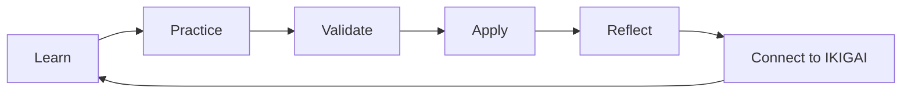
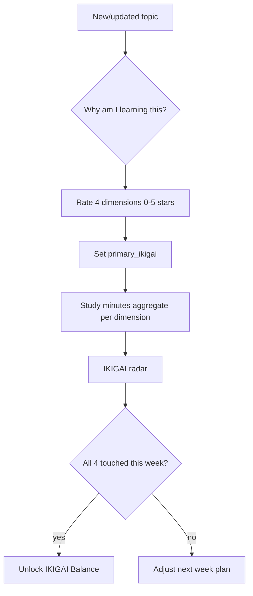
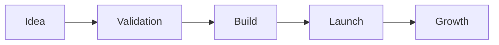
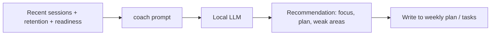
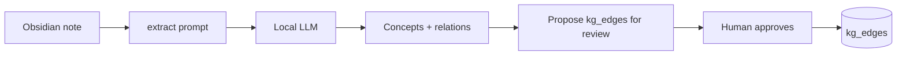

# 07 — Workflow Definitions

Operational workflows that turn the platform into a daily practice. Covers
Learning, IKIGAI alignment, Business, Personal, and the local AI assistant.

---

## 1. Master Learning Loop



Each stage maps to concrete system actions:

| Stage | Action | System write |
|---|---|---|
| Learn | Read/watch/notes | `study_sessions` + XP (Read/Notes) |
| Practice | Labs, exercises, mock Qs | `study_sessions` + XP (Lab/Quiz) |
| Validate | L1–L4 gate | `validations` (+ maturity promotion) |
| Apply | Build a project | `projects` + XP (Project) + `kg_edges applies` |
| Reflect | What worked / weak areas | `weekly_reviews` |
| Connect | Confirm purpose | `topic_ikigai_alignment` / radar |

---

## 2. Learning Workflow (Plan → Improve)

```text
Plan → Learn → Practice → Test → Review → Improve
```

### Weekly plan
- Pick **1 primary interview role** + **3 priority topics**; define one
  measurable result each. Cap active topics at **5**.

### Daily process
- **Morning:** open Home; choose 1 topic + 1 measurable result; schedule 1–2 sessions.
- **During:** timer on, single topic, concise notes, recall without notes, record confidence.
- **End of day:** log session, note what improved / what's unclear, schedule next review, confirm backup.

### Test (validation)
- Explain in 2 min (L1) → answer 3 questions (L2) → build a small example (L3) →
  teach it (L4). Record scores; compare against trusted docs.

### Review (retention)
- Grade due items (SM-2 ladder 1/3/7/14/30/90).

### Improve (weekly)
- Remove low-value activity, double down on weak topics, archive completed work,
  select next week's focus. Capture in `weekly_reviews`.

---

## 3. IKIGAI Workflow



Cadence:
- **Per topic:** answer the purpose question; set alignment.
- **Weekly:** review the radar; rebalance if one dimension is starved.
- **Quarterly/Annual:** IKIGAI review in `10-IKIGAI/Annual-Reviews`.

Rule of thumb: **Profession + Interview** dominate the current phase, but keep a
minimum weekly touch on Passion and Mission to avoid burnout and stay aligned.

---

## 4. Business Learning Workflow (TECHTARIS)



- Business learning is **P3** (after interview + work learning).
- Track initiatives in `business_initiatives` with a `stage` pipeline and
  `primary_ikigai` (usually Vocation/Mission).
- Learning that serves a business initiative links via `kg_edges applies` /
  `advances`, but **notes stay separated** (`02-Business/`), only *linked* to
  learning notes:
  ```markdown
  Related business project: [[TECHTARIS Payment System]]
  Learning topic: [[Stripe Integration Security]]
  ```
- Weekly: pick at most one business-learning objective so it never crowds out
  interview prep.

---

## 5. Personal Growth Workflow

- Domain `Personal` holds tasks, finance, health, home (`03-Personal/`).
- Use `tasks` with priority (P1–P5) and due dates; enforce separation from
  learning.
- Personal development is **P5** but still tracked so the "life OS" is complete.
- Optional personal goals live in `goals` with horizon `month/quarter/year/life`.

Daily limit (from source): **1 main learning goal + 2 supporting tasks + 1
review task.**

---

## 6. AI Assistant & Local LLM Workflows

Runs on **Ollama** (compose profile `ai`). All calls stay in-network; every
interaction is logged to `ai_interactions`.

### Capabilities (`POST /ai/generate`, `kind=`)
| Kind | Use | Output |
|---|---|---|
| `coach` | Weekly plan, next best action, weak-area advice | guidance text |
| `quiz` | Generate quiz questions for a topic | questions + answers |
| `summarize` | Condense notes | structured bullets |
| `extract` | Pull concepts/relationships from notes | KG outline → `kg_edges` |
| `interview` | Mock interview, one Q at a time + feedback | Q/A + score |

### Coaching flow


### Knowledge extraction flow


Safety: LLM output is **advisory**. The system never executes model-produced SQL
or shell commands; extracted edges require human approval before persistence.

### Models
- Chat/coach/interview: `OLLAMA_CHAT_MODEL` (default `llama3.1:8b`).
- Embeddings (Phase 3 semantic search): `OLLAMA_EMBED_MODEL` (`nomic-embed-text`).

---

## 7. Automation Workflows (n8n, profile `automation`) — Phase 2

| Workflow | Trigger | Action |
|---|---|---|
| Daily study reminder | cron 08:00 | notify + open Home |
| Weekly summary | cron Sun 18:00 | build scorecard from views, post digest |
| Review scheduler | cron 06:00 | list `v_reviews_due`, notify |
| Backup verification | cron 09:00 | assert today's backup exists, else alert |
| Dashboard refresh | after import | trigger Metabase cache refresh |

---

## 8. Weekly Review Workflow

Every Sunday:
1. Review total study time & confidence changes (`v_weekly_study_time`, `v_confidence_improvement`).
2. Identify weakest category (`v_interview_readiness`).
3. Review missed study days; pick next role + 3 topics.
4. Archive completed work; confirm backups valid.
5. Write `weekly_reviews` (focus/consistency/confidence/interview + IKIGAI + grade).
