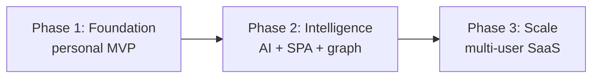

# 08 — Implementation Roadmap, MVP, Phase Plans & Risk Register

---

## 1. MVP Definition

**Thesis to prove:** *purpose-linked, validated learning* works end-to-end,
locally, and is worth using daily.

### MVP scope (build first)
- **Infra:** Docker Compose (Postgres, API, Metabase, backup); `.env`; daily backups + restore.
- **Data:** full schema, analytics views, reference seed, example topics.
- **API:** topics, sessions, XP, validations, interview questions, retention, analytics, health.
- **Knowledge:** Obsidian vault structure + templates (topic, daily, interview, weekly, scorecard).
- **Insight:** Metabase "Learning Command Center" dashboard.
- **Purpose:** IKIGAI alignment on topics + radar data.

### Explicitly deferred
Web SPA, AI assistant UI, quiz engine UI, mock interviews, goals/career/business
module UIs, n8n automation, multi-user auth UI, knowledge-graph visualization.

### MVP acceptance criteria
1. `docker compose up -d` brings up a healthy stack; DB is seeded.
2. Can create a topic with IKIGAI alignment via API/Swagger.
3. Can log study sessions and see confidence-improvement chart in Metabase.
4. Can award XP and see `topics.xp_total` update.
5. Can record L1–L4 validations; passing L4 sets maturity to Teaching.
6. Can track and grade a spaced review; `next_review` advances per SM-2.
7. Nightly backup file appears; restore into a scratch DB succeeds.
8. Obsidian vault opens with templates; a topic note reconciles conceptually with DB.

---

## 2. Roadmap Overview



| Phase | Theme | Outcome |
|---|---|---|
| **1** | Foundation | A usable personal Learning OS (this repo). |
| **2** | Intelligence & UX | Local AI, web SPA, knowledge graph, automation. |
| **3** | Scale & SaaS | Multi-user, RBAC/RLS, managed infra, billing. |

---

## 3. Phase 1 — Foundation (MVP)

**Goal:** daily-usable personal system; interview-first.

**Workstreams**
1. Infra & data (done in this scaffold): compose, schema, views, seed, backups.
2. API core (done): topics, sessions, xp, validations, interview, retention, analytics.
3. Knowledge (done): vault + templates.
4. Dashboards: build the four Metabase dashboards from `05-…§5`.
5. Adoption: 14-day setup + first 10 interview questions + first weekly review.

**14-day setup plan (from source docs)**
- Days 1–2: folders, Docker, start Postgres + Metabase (+ API).
- Days 3–4: open vault, add templates, first 10 interview questions.
- Days 5–7: log daily sessions, build first dashboard, test backup + one restore.
- Week 2: track consistency, practice answers, review confidence, adjust; add
  work/business topics only after the interview workflow is stable.

**Exit criteria:** all MVP acceptance criteria pass; ≥ 5 study days logged in week 2.

---

## 4. Phase 2 — Intelligence & UX

**Goal:** reduce friction and add leverage.

- **Local AI (Ollama):** enable `/ai/generate`; coach, quiz, summarize, extract,
  mock interview; log to `ai_interactions`.
- **Web SPA (React):** implement wireframes in `05-…§3` (Home, Topic detail,
  Interview, Retention, IKIGAI, embedded analytics).
- **Quiz engine:** `quizzes/quiz_questions/quiz_attempts` UI; AI-generated quizzes
  auto-create L1/L2 validations.
- **Knowledge graph:** `/graph` endpoints + force-directed visualization; AI
  extraction proposes edges for approval.
- **Goals/Career/Skills/Certs/Business modules:** CRUD + roadmap + skill matrix + gap analysis.
- **Automation (n8n):** reminders, weekly summary, review scheduler, backup verification.
- **Auth (optional):** turn on JWT; keep single-user default.

**Exit criteria:** AI coach produces a usable weekly plan; SPA covers daily loop
without touching SQL; graph shows real relationships.

---

## 5. Phase 3 — Scale & SaaS

**Goal:** evolve into a multi-user product.

- **Multi-tenant:** enable Postgres **RLS** using existing `user_id`; org/team model.
- **AuthN/Z:** full registration, roles (owner/member/coach/admin), invitations.
- **Infra:** managed Postgres (+ read replicas), stateless API replicas + LB,
  object storage for artifacts, background workers (Celery/RQ) for AI + retention,
  Redis cache, PgBouncer.
- **Model gateway:** per-tenant Ollama or hosted model routing with quotas.
- **Analytics at scale:** per-tenant dashboards, event pipeline.
- **Billing & admin:** subscriptions, usage metering, admin console.
- **Compliance:** audit logs, data export/delete (GDPR), encryption at rest.

**Exit criteria:** two isolated tenants run concurrently with enforced RLS;
horizontal API scaling verified; artifacts in object storage.

---

## 6. Milestone Timeline (indicative, effort-ordered — not dates)

```text
M1  Stack up + seeded (Phase 1)
M2  Dashboards live + first weekly review (Phase 1)
M3  Local AI coach + quiz engine (Phase 2)
M4  Web SPA covering daily loop (Phase 2)
M5  Knowledge graph + goals/career/skills (Phase 2)
M6  Multi-user RLS + managed infra (Phase 3)
M7  Billing + admin + compliance (Phase 3)
```

---

## 7. Technical Debt Register

| ID | Debt | Impact | Planned resolution |
|---|---|---|---|
| TD-1 | Raw SQL init instead of migrations | Hard schema evolution | Adopt Alembic in Phase 2; baseline from `001_schema.sql`. |
| TD-2 | ORM maps only a subset of tables | Some writes need raw SQL | Expand models per module in Phase 2. |
| TD-3 | Permissive CORS `*` | Not safe beyond localhost | Restrict origins when SPA/auth land. |
| TD-4 | Single-user shortcut (fixed owner UUID) | Not multi-tenant | Wire real auth + RLS in Phase 3. |
| TD-5 | Achievement unlocks not automated | Manual badges | Rules engine over `criteria` JSON (Phase 2). |
| TD-6 | Vault ↔ DB reconciliation manual | Drift between notes/metrics | `/vault/reconcile` job (Phase 2). |
| TD-7 | Metabase app DB on file (H2) | Not production-grade | Move Metabase to Postgres in Phase 2/3. |
| TD-8 | No automated tests yet | Regression risk | Add pytest + CI in Phase 2. |
| TD-9 | No metrics/tracing | Limited observability | Prometheus/Grafana in Phase 2. |

---

## 8. Risk Register

Likelihood/Impact: L/M/H.

| ID | Risk | L | I | Mitigation |
|---|---|---|---|---|
| R-1 | **Data loss** (disk failure) | M | H | Daily backups + 3-2-1 off-device copy + restore drills. |
| R-2 | **Secret leakage** (`.env` committed) | L | H | `.gitignore` blocks it; use secret manager in SaaS. |
| R-3 | **Over-engineering kills adoption** | M | H | Ship MVP first; defer SPA/AI until daily loop is habitual. |
| R-4 | **Tracking activity, not purpose** (original problem returns) | M | H | IKIGAI required on topics; radar in weekly review. |
| R-5 | **Validation skipped** (notes ≠ mastery) | M | M | Completion gated on validations; retention queue. |
| R-6 | **Local LLM too slow/heavy** | M | M | Optional `ai` profile; small models; async workers later. |
| R-7 | **Metric overload / vanity metrics** | M | M | Track improvement + output, not just hours. |
| R-8 | **Scope creep across domains** | M | M | Separation rules; priority order P1→P5; 5-topic cap. |
| R-9 | **SQL injection / input abuse** | L | H | Parameterized queries; Pydantic + CHECK constraints. |
| R-10 | **Multi-tenant data leak** (future) | M | H | RLS on `user_id`; tenant tests before GA. |
| R-11 | **Burnout** (all Profession, no Passion) | M | M | IKIGAI balance badge; weekly rebalance. |
| R-12 | **Backup never verified** | M | H | n8n backup-verification workflow; periodic restore test. |

---

## 9. Definition of Done (per feature)

1. Schema + view (if analytical) exists and is documented.
2. API endpoint with Pydantic validation + ownership check.
3. Dashboard card or UI surface (where user-facing).
4. Docs updated (this set).
5. Backup covers any new tables (it does — full `pg_dump`).
6. Manual smoke test recorded; automated test added in Phase 2+.
