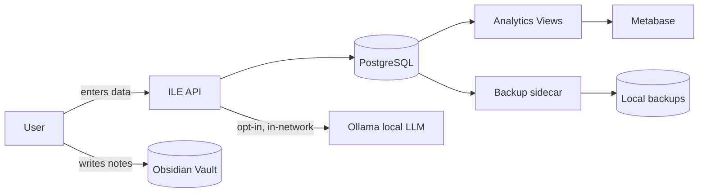

# 13 — Privacy Impact Assessment (PIA / DPIA)

**Scope:** the open-source, self-hosted ILE software.
**Assessment date:** 2026-08-02 · **Owner:** ILE maintainers.

This DPIA-style assessment evaluates privacy risks of the software as shipped.
It complements the user-facing [`PRIVACY.md`](../PRIVACY.md).

---

## 1. Context & roles

- ILE is **self-hosted**. The person/organization running ILE is the **data
  controller**. The maintainers **never receive user data** and are not a
  processor for self-hosted deployments.
- A future hosted "ILE Cloud" would require a **separate** DPIA and DPA.

## 2. Data inventory

| # | Data category | Sensitivity | Store | Lawful basis (self-host) |
|---|---|---|---|---|
| D1 | Learning topics, sessions, XP, validations, maturity | Medium | Postgres | Legitimate interest / self-use |
| D2 | Interview Q&A, STAR answers, readiness, simulations | Medium–High | Postgres | Self-use |
| D3 | Notes, reflections, journals | **High** | Obsidian vault (Markdown) | Self-use |
| D4 | IKIGAI reflections, goals, career, business | **High** | Postgres | Self-use |
| D5 | AI prompts/responses (local) | Medium–High | Postgres `ai_interactions` | Self-use / consent (opt-in AI) |
| D6 | Analytics aggregates | Low–Medium | Postgres views / Metabase | Self-use |
| D7 | Backups (contain all of the above) | **High** | `data/backups/` on disk | Self-use |
| D8 | Auth data (multi-user mode): email, password hash | High | Postgres `users` | Contract/consent |

No special-category data is required by the system; users may voluntarily write
sensitive reflections into notes (D3) — treated as High.

## 3. Data-flow mapping

**All flows stay on the operator's machine/network.** The only optional external
edge is if a user deliberately configures a remote model provider (not shipped
by default), which ILE flags before use.

## 4. Privacy-by-design & by-default assessment

| Principle (GDPR Art. 25) | Status | Evidence |
|---|---|---|
| Data minimization | ✅ | Only data the user enters; no tracking/telemetry. |
| Purpose limitation | ✅ | Data used solely for app features; no secondary use possible. |
| Storage limitation | ✅ | User-controlled; backups auto-prune (`BACKUP_RETENTION_DAYS`). |
| Default = most private | ✅ | Local-only, no accounts, AI/sync off by default. |
| Transparency | ✅ | PRIVACY.md, this PIA, open source code. |
| Security | ✅ | See [14-Security-Architecture.md](14-Security-Architecture.md). |
| Portability | ✅ | Markdown notes + SQL/CSV/JSON export. |
| Erasure | ✅ | Delete rows/files/volumes; `ON DELETE CASCADE`. |

## 5. Data subject rights — how ILE supports them

| Right (GDPR/CCPA/CPRA) | Mechanism in ILE |
|---|---|
| Access | Direct DB/API access; notes are plain files. |
| Portability | Backup dump; `psql \copy` CSV; Metabase export; (roadmap) one-command export to MD/JSON/CSV. |
| Rectification | Edit via API/SQL/notes. |
| Erasure / "forgotten" | Delete records/files/volumes; purge backups. |
| Restriction/Objection | Disable features (e.g., AI) or stop processing. |
| No automated decisions with legal effect | AI is advisory only; no automated adverse decisions (see TERMS §5–6). |

## 6. Risk register (privacy-specific)

| ID | Risk | Likelihood | Impact | Mitigation |
|---|---|---|---|---|
| P1 | Unencrypted disk exposes sensitive notes/backups | M | H | Guidance to encrypt disk & backups; 3-2-1; off-device encrypted copy. |
| P2 | Operator exposes API/DB to the internet without auth | M | H | Secure defaults (localhost); docs warn; multi-user requires JWT; RLS available. |
| P3 | Backups copied to insecure location | M | H | Docs mandate encryption for off-device copies. |
| P4 | User sends sensitive data to an external LLM they configured | L | M | External providers are non-default; ILE warns before use; local LLM recommended. |
| P5 | Secrets committed to a fork | L | H | `.gitignore` + CI secret scanning (gitleaks/Trivy). |
| P6 | Multi-user data leakage across tenants (future) | M | H | Postgres RLS on `user_id`; tenant isolation tests before GA. |
| P7 | AI interaction logs retain sensitive prompts | M | M | Local-only storage; user can disable logging / purge `ai_interactions`. |

Residual risk after mitigations: **Low** for the default local-only mode.

## 7. Retention & deletion defaults
- Application data: retained until the user deletes it (no auto-expiry).
- Backups: pruned after `BACKUP_RETENTION_DAYS` (default 30).
- AI logs: retained locally; user-purgeable.

## 8. Third-party processors
For **self-hosting: none** (nothing leaves the operator's control). For any
future hosted offering, processors would be enumerated with DPAs in a separate
assessment.

## 9. Recommendations (tracked)
1. Ship one-command **export** (MD/JSON/CSV) and **purge** utilities (Phase 1/2).
2. Add optional **at-rest encryption** guidance script for the backups volume.
3. Add a **"data map" doc page** rendered from the schema for operator DPIAs.
4. When multi-user lands, ship **RLS policies on by default** and isolation tests.

## 10. Conclusion
As shipped (local-first, no telemetry, opt-in AI/sync), ILE presents **low
inherent privacy risk** and provides the technical means for controllers to meet
GDPR/CCPA/CPRA obligations. The primary residual risks are **operator
deployment choices** (encryption, exposure), addressed through secure defaults
and documentation.
