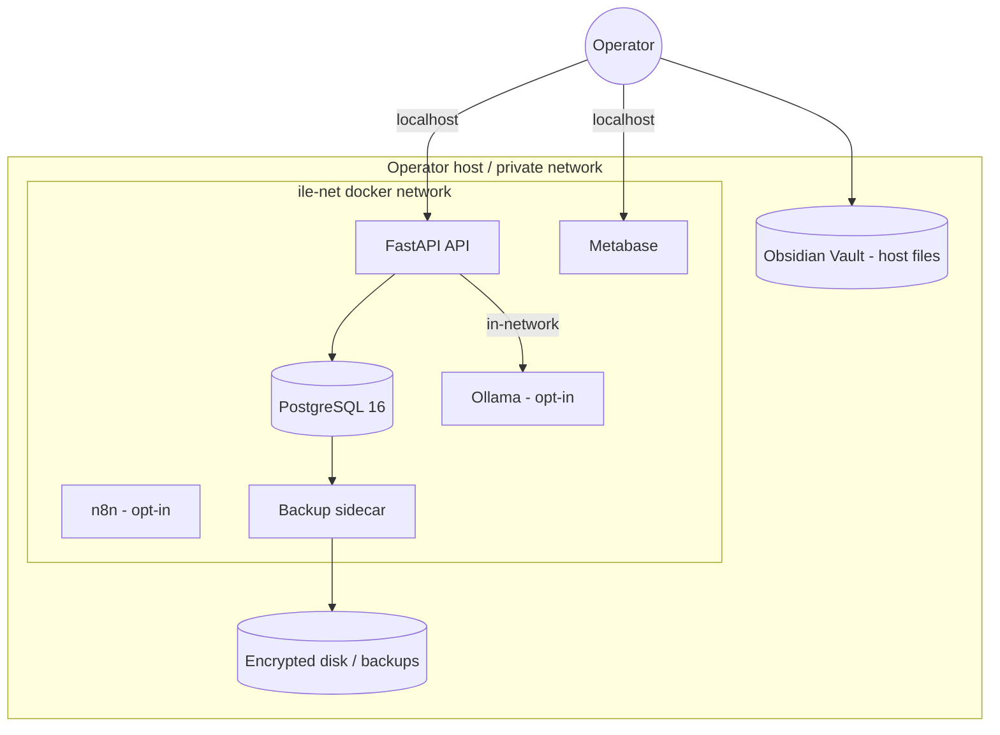

# 14 — Security Architecture

Security design of ILE. Companion to [`SECURITY.md`](../SECURITY.md) (reporting),
[15-Threat-Model.md](15-Threat-Model.md) (STRIDE), and
[20-Incident-Response-and-DR.md](20-Incident-Response-and-DR.md).

---

## 1. Security principles

1. **Local-first, minimal attack surface** — default install binds to localhost;
   nothing is exposed publicly unless the operator chooses to.
2. **Secure by default** — no anonymous internet access, secrets via env/secret
   files, least-privilege DB usage.
3. **Defense in depth** — network isolation, app-layer validation, DB
   constraints, and (multi-user) row-level security.
4. **User owns the keys** — encryption and backups are under operator control.

## 2. Architecture & trust boundaries

**Trust boundaries:** (a) host ↔ outside world (closed by default),
(b) container network ↔ host, (c) API ↔ database, (d) user ↔ optional LLM.

## 3. Deployment modes & authentication

ILE ships two modes controlled by `API_SINGLE_USER_MODE`:

### Single-user mode (default)
- No authentication; intended for **localhost / trusted LAN** only.
- All rows are owned by a fixed owner UUID.
- **Never expose this mode to the public internet.**

### Multi-user mode (`API_SINGLE_USER_MODE=false`)
- **JWT bearer** auth; passwords hashed with a strong KDF (bcrypt/argon2 via
  passlib). Short-lived access tokens.
- **RBAC** roles (user/admin) and per-row `user_id` ownership.
- **PostgreSQL Row-Level Security** policies on `user_id` for tenant isolation
  (enabled before any multi-tenant GA).
- Roadmap: passkeys/WebAuthn, OAuth2/OIDC SSO, MFA/TOTP, refresh-token rotation,
  session revocation. See [ROADMAP.md](../ROADMAP.md).

## 4. Data security

| Layer | Control |
|---|---|
| **At rest** | Operator disk encryption (FileVault/LUKS/BitLocker) recommended; backups encryption guidance in doc 20. Passwords hashed (never stored plaintext). `pgcrypto` available for field-level needs. |
| **In transit** | Localhost by default. For remote access: **TLS 1.2+/1.3** via a reverse proxy (Caddy/Traefik/Nginx) terminating HTTPS; DB traffic stays inside `ile-net`. |
| **Secrets** | Provided via environment/Docker secrets, never committed. `.env` is git-ignored; CI scans for leaks. |
| **Backups** | Automated `pg_dump` sidecar; retention-pruned; operator encrypts off-device copies (3-2-1). |
| **Audit logging** | `ai_interactions` and timestamped rows; Postgres logs. Structured audit log for auth/admin events on the multi-user roadmap. |

## 5. Application security

- **Input validation:** Pydantic v2 models validate/coerce all request bodies.
- **SQL injection:** SQLAlchemy 2.0 parameterized queries / bound params only;
  no string-built SQL.
- **AuthZ checks:** every owned resource filtered by `user_id`; admin routes
  gated by role (multi-user).
- **CORS:** restricted origins; permissive only in explicit local dev.
- **Error handling:** no stack traces or secrets in responses; generic 4xx/5xx.
- **Rate limiting / brute-force:** reverse-proxy rate limits recommended;
  login throttling on the multi-user roadmap.
- **Dependencies:** pinned; **Dependabot** weekly; **Trivy** + **gitleaks** in
  CI; **SBOM** (SPDX via Syft) published per build.
- **OWASP Top 10 mapping:** see [15-Threat-Model.md](15-Threat-Model.md#owasp-top-10-mapping).

## 6. Network & container hardening

- Only the API and Metabase publish ports (localhost-bound by default); Postgres
  is **not** published outside `ile-net`.
- Optional services (Ollama, n8n) run under Compose **profiles**, off by default.
- Recommended: run containers as non-root, read-only root FS where feasible,
  drop capabilities, set resource limits, keep base images patched.
- Recommended production edge: reverse proxy with HTTPS + auth + rate limiting;
  never publish the database port.

## 7. AI security
- Default model runtime is **local Ollama** — prompts and responses **stay on the
  host**. Returns `503` if the model service is unavailable (fails safe).
- No external AI provider is configured by default; if an operator adds one, the
  UI warns that data will leave the device.
- Treat AI output as **untrusted**: never execute it, and validate before use.

## 8. Secure defaults checklist (shipped)
- [x] Localhost binding by default.
- [x] Postgres port not exposed outside the container network.
- [x] Optional/risky services behind profiles, off by default.
- [x] `.env`/secrets git-ignored; CI secret scanning.
- [x] Parameterized SQL; validated inputs.
- [x] Pinned deps + Dependabot + Trivy + SBOM.

## 9. Hardening checklist for operators (production/remote)
- [ ] Enable full-disk encryption on the host.
- [ ] Put ILE behind an HTTPS reverse proxy (TLS 1.3) with auth + rate limiting.
- [ ] Set `API_SINGLE_USER_MODE=false` and strong secrets/JWT keys.
- [ ] Enable Postgres RLS (multi-user).
- [ ] Encrypt off-device backups; test restores (doc 20).
- [ ] Keep images/deps updated; watch security advisories.
- [ ] Restrict/disable Metabase & n8n exposure.

See [SECURITY.md](../SECURITY.md) to report vulnerabilities.
